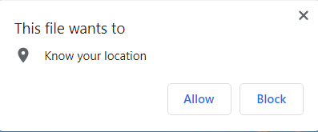

# Playdate: The App for Exhausted Parents!

## Description

**Welcome, parents with children or anyone who may be bored!**
This interactive webpage project is designed for use primarily by parents seeking recommendations or ideas for activities to do with their children. Alternatively, it can also function as a kid-friendly app for your average bored person to find and explore local activities. 

When given permission to retrieve current location in the browser window, search results are filtered by current weather conditions at the user's current position. The browser uses Materialize for the CSS framework and JQuery in Javascript, as well as saving search items to local storage. 

This interactive webpage app calls from public API's Weatherbit and Mapbox for data on local weather conditions and maps respectively. Building the app combined practiced knowledge of HTML, CSS, and JQuery applications, and served as a practical application of group collaboration with GitHub branching and merging.

## Usage

Upon opening the webpage, the navigator popup will prompt the user to allow the browser to fetch their current location.

Once the browser has retrieved the current location coordinates, the weather bar at the top will change to reflect the current weather conditions at the current location.
(image)

Clicking the start button in the middle will open the main screen.

Upon entry, the user will have a map displayed in the center of the screen with weather still displayed at the top. Markers on the map will display suggestions for nearby activities based on the weather.

Clicking on any of the suggestions will cause the central card to populate with information about the selected location.

From the central card, you can click on the bottom section to reveal a text box. Here you can leave your own review and thoughts. Those will be available for you the next time you check the site from the computer you're currently using.

## Credits

Creators of this group project and associated GitHub profiles:

Mark Gardner: https://github.com/MarkGATX

Jimmy Huang: https://github.com/jimmehhuang

Oscar Pererz-Hernandez: https://github.com/LilOTechGod

API's referenced in this project:

Weatherbit.io: https://www.weatherbit.io/api/weather-current

Mapbox: https://docs.mapbox.com/api/maps/ 

## License

Refer to license in repo or as below:

MIT License

Copyright (c) 2022 MarkGATX

Permission is hereby granted, free of charge, to any person obtaining a copy of this software and associated documentation files (the "Software"), to deal in the Software without restriction, including without limitation the rights to use, copy, modify, merge, publish, distribute, sublicense, and/or sell copies of the Software, and to permit persons to whom the Software is furnished to do so, subject to the following conditions:

The above copyright notice and this permission notice shall be included in all copies or substantial portions of the Software.

THE SOFTWARE IS PROVIDED "AS IS", WITHOUT WARRANTY OF ANY KIND, EXPRESS OR IMPLIED, INCLUDING BUT NOT LIMITED TO THE WARRANTIES OF MERCHANTABILITY, FITNESS FOR A PARTICULAR PURPOSE AND NONINFRINGEMENT. IN NO EVENT SHALL THE AUTHORS OR COPYRIGHT HOLDERS BE LIABLE FOR ANY CLAIM, DAMAGES OR OTHER LIABILITY, WHETHER IN AN ACTION OF CONTRACT, TORT OR OTHERWISE, ARISING FROM, OUT OF OR IN CONNECTION WITH THE SOFTWARE OR THE USE OR OTHER DEALINGS IN THE SOFTWARE.